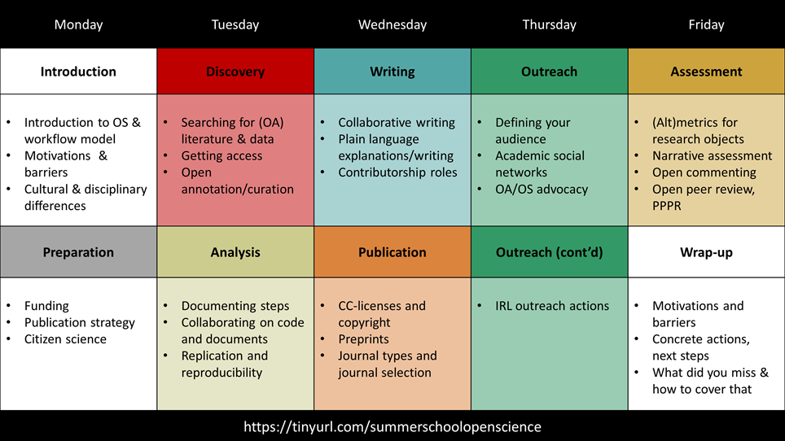
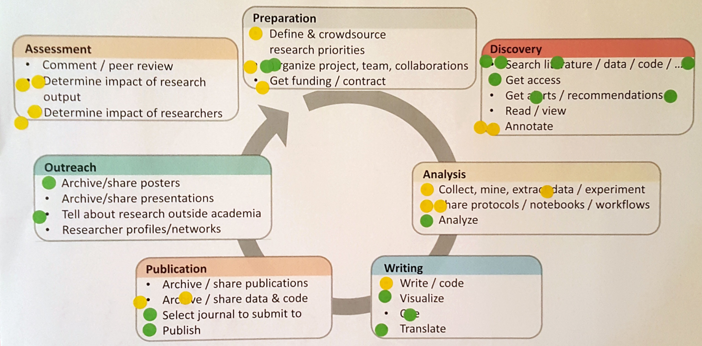
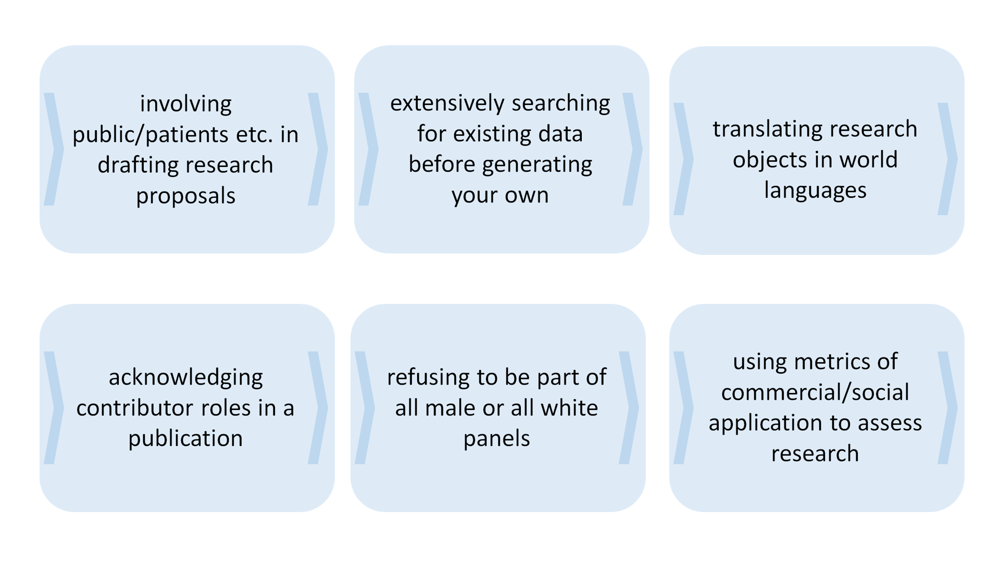
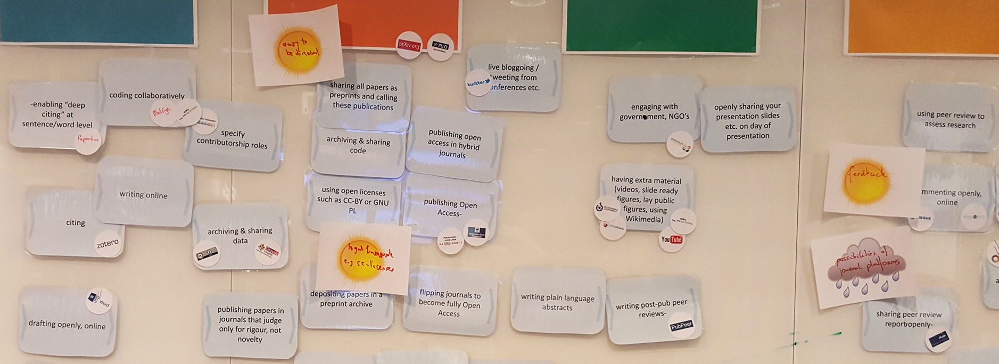
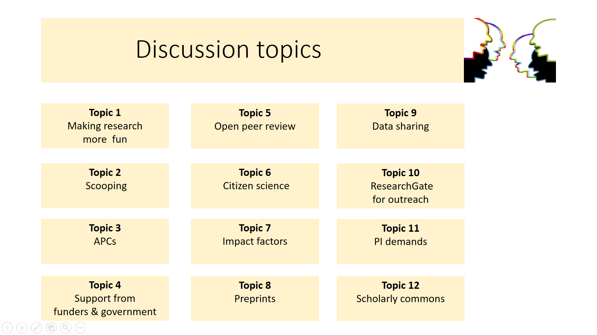
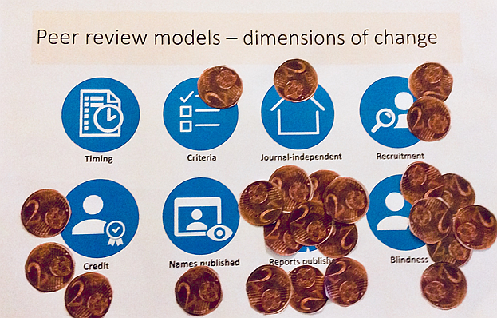
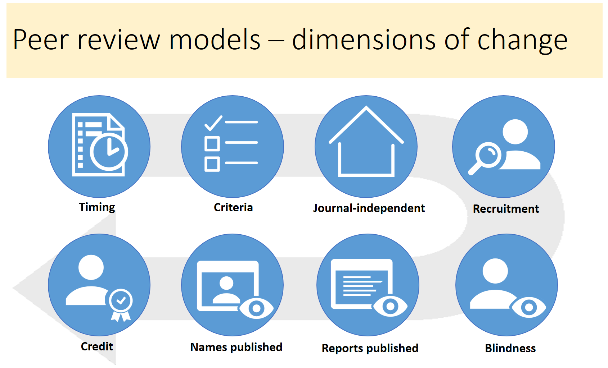
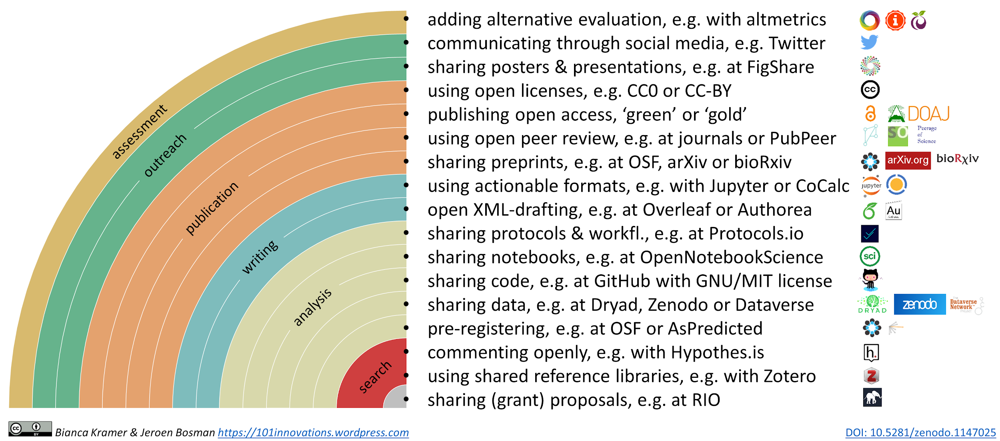
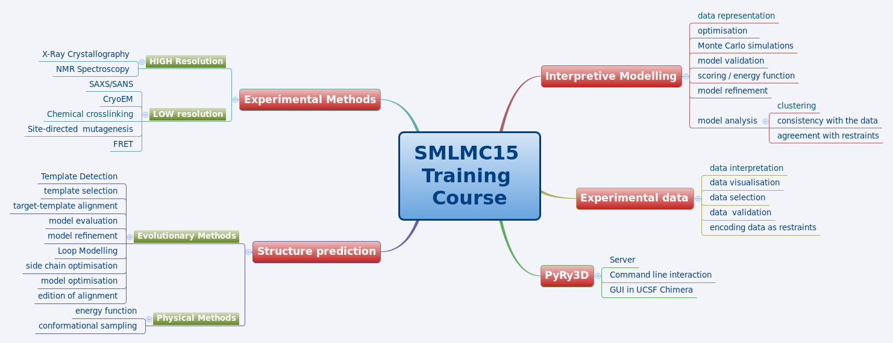

 
### Examples & Practical Guidance: adopt, adapt, develop

In this chapter, you will find a wealth of materials to help you actively engage your trainees in critically examining Open Science issues.

We recommend you approach all of these materials with the motto "Adopt, adapt, develop" in mind—meaning that its best to re-use what exists where possible. Hence, before you start developing training resources from scratch you should find out whether there are existing resources you may use. We give some example resources here, with tips for how they could be adapted for your purposes. We also provide links and strategies to help you find further material. In some cases, existing resources may be used as they are, so you may simply **adopt** them. An example at stake may be an openly available video tutorial about open file formats which you may point your audience to. In other cases, you may have to **adapt** existing resources somewhat in order to make them fit your purposes. For example, you may need to add/replace some institution- or country-specific references to an existing overview of Open Access requirements issued by research funders. Only as a last resort you should **develop** your own training resources from scratch. If you want to develop your own training materials, be sure to develop Open Educational Resources so that other trainers can reuse and adapt your materials.

### Example training structures

**Open Science Göttingen Meet-ups **at the University Library at Uni Göttingen** (3 hours)**

The Open Science Network Göttingen, a group of researchers and librarians who support open science practices and knowledge exchange regularly organize these meet-up events where various open science related topics are discussed. The network unites people interested in Open Science topics at the Göttingen Campus and is open to everyone. They have become quite popular attracting scholars from different disciplines who are eager to discuss their experiences with open scholarship and to learn about new methods, tools, and practices. Invited speakers usually introduce the topics which is followed by small group discussions with a more in-depth view on related issues. 

More information: [https://www.sub.uni-goettingen.de/en/electronic-publishing/open-science/](https://www.sub.uni-goettingen.de/en/electronic-publishing/open-science/)

**Mozilla Study groups (a series of 2–3 hour meetings)**

Study groups are communities of peers (e.g., from the same institution) committed to learning and teaching each other. They’re fun, informal meetups allowing participants to share skills, experiences, and ideas around open science, open source, code, and community in research. The goal of the [Mozilla Study Group Project](https://science.mozilla.org/programs/studygroups) is to support this kind of peer-to-peer study by providing a simple set of tools, template lesson plans, and access to an international community of like-minded researchers and avid learners in code
(text adapted from [https://science.mozilla.org/programs/studygroups](https://science.mozilla.org/programs/studygroups))

**Reproducible analysis and Research Transparency (a single full-day workshop)**

Transparency, open sharing, and reproducibility are core values of science, but not always part of daily practice. A first iteration of this workshop took place within the context of the [Open Science Tools, Data & Technologies for Efficient Ecological & Evolutionary Research](https://nioo.knaw.nl/en/open-science-tools) event, organized by NIOO-KNAW and DANS-KNAW. It provides an overview of current status in reproducible analysis in order to provide transparency in research. The workshop covers methodological topics (such as the use of the Open Science Framework and reporting guidelines) as well as software tools (such as Git, Docker, RMarkdown / knitr, and Jupyter). Going beyond simple listing and presentations, the second half of the workshop focuses on hands-on skill building, with exercises and tutorials covering most of the software aspects. Material and content is available here: [http://reproducible-analysis-workshop.readthedocs.io](http://reproducible-analysis-workshop.readthedocs.io)

**Open Science: what’s in it for me? (1-2 days)**

The aim of the workshop is to provide researchers and administrators with hands-on examples of Open Science tools and workflow examples across various disciplines, and to start applying and discussing these. For this, we present an overview of Open Science practices and tools that are used throughout the scientific workflow, with practical examples, audience polling and interactive discussions. The second day is oriented at application and sharing. In various rounds participants explore and where possible try out or apply tools and practices. They do this in small groups and individually and also in a lively marketplace. In a final session we have a discussion on obstacles and incentives for switching to open science in your own research.

[Open Science - what’s in it for me](https://www.authorea.com/users/111423/articles/200860-open-science-workshop-what-s-in-it-for-me-postmortem-report) (Vienna, 2017, workshop report)

[Open Science - what’s in it for me](http://www.oa.unito.it/new/open-science-whats-in-it-for-me-torino-8-e-9-marzo-2018/) (Torino, 2018, workshop programme)

**Carpentry workshops (2 days)**

A Carpentry workshop is a hands-on two-day event that covers the core skills needed to be productive in a small research team. Short tutorials alternate with practical exercises, and all instruction is done via live coding. Software Carpentry was founded in 1998 and Data Carpentry was founded in 2013. Both focus on computational skills, run two-day workshops taught by volunteer instructors, and strive to fill gaps in current training for researchers. However, they differ in their content and intended audience. Data Carpentry workshops focus on best practices surrounding data. Its learners are not people who want to learn about coding, but rather those who have a lot of data and don’t know what to do with it. Data Carpentry workshops are aimed at pure novices, are domain-specific, and present a full curriculum centered around a single data set. Software Carpentry workshops are intended for people who need to program more effectively to solve their computational challenges, are not domain-specific, and are modular—each Software Carpentry lesson is standalone.

Software Carpentry: [https://software-carpentry.org](https://software-carpentry.org)

Data Carpentry: [http://www.datacarpentry.org/](http://www.datacarpentry.org/)

**EIFL Train-the-Trainer programme (4 days)**

EIFL organized a train-the-trainers programme for five universities in EIFL partner countries (Ethiopia, Ghana, Zimbabwe, Tanzania, and Nepal) that have committed to integrating open access, open science and open research data into courses for PhD students. Day 1 covered open access and open data. Day 2 and 3 were dedicated to open science across the research workflow, including current practices at participant’s universities. On Day 4, participants designed and prepared their own training programme. 

[EIFL Train-the-trainer programme](https://osf.io/qf76a/) (Addis Ababa, 2017, programme and materials)

**Open Science summer schools (5 days)**

Various universities across Europe organize weeklong summer schools on open science, primarily aimed at early career researchers. These events cover a variety of topics in five days, usually with many hands-on activities to apply open science into daily practice. 

[EPFL Summer school Open Science in Practice ](http://archiveweb.epfl.ch/osip2017.epfl.ch/page-146300-fr.html)(2017, programme overview)

[Utrecht University Summer school Open Science and Scholarship](https://tinyurl.com/sumsopenscience2017) (2017, programme and materials)

[Essex Summer school in Social Science and Data Analysis - Introduction in Open Science](https://www.fosteropenscience.eu/event/essex-summer-school-social-science-data-analysis-introduction-open-science) (2017, programme overview) 

[LERU Doctoral Summer school on Data Stewardship](https://www.graduateacademy.uni-heidelberg.de/md/gradakad/akademie/leru_summer_school_2016_description.pdf) (2016, description, learning objectives) 

*Programme schedule Summer School Open Science and Scholarship, Utrecht University 2017*

### Example Exercises

#### Master Template

* Format, time needed 

* Topic [link back to [Chapter 4](https://docs.google.com/document/d/1YpuL5uDEJNoYNMpcabXuCYTxZCwg9or-DJ6D9cJWM7w/edit#)]

* Learning objectives 

* Exercise description

* Materials and tools needed

* Level of prior knowledge needed

* Things to bear in mind

* How to adapt for other purposes

**use**** Google form to suggest additional exercises: ****[https://goo.gl/forms/wxyx6pk80mHUHTRu**1](https://goo.gl/forms/wxyx6pk80mHUHTRu1)** **

#### Types of exercises

**[convert to narrative, including possible goals  - in progress]**

**[also possibly link to / include existing taxonomy/-mies]**

    * quick warm-up / short break exercises 

    * small group exercises

        * role-play

        * discuss OS topics/statements

        * marketplace: exchange experiences/expertise

        * meeting with researchers / policy makers

        * ...

    * plenary exercises

        * collaborative mapping

        * simulation game 

        * inventorizing

        * card games

    * presentations

        * role-play

        * present real-life cases/examples (also by participants)

        * one-minute presentations of a concept (by participants) 

        * guest lecturers

        * ...

    * hands-on exercises (individual or in pairs)

        * visualizing

        * explore / try out tools & platforms

        * implement an open science practice in your own research

        * check reproducibility of a research paper

        * … 

#### Example exercises (including materials)

<table>
  <tr>
    <td></td>
    <td>Title</td>
    <td>Topic</td>
    <td>Type</td>
    <td>Duration</td>
  </tr>
  <tr>
    <td>1</td>
    <td>Line up!</td>
    <td>general</td>
    <td>whole group</td>
    <td>5-10 min</td>
  </tr>
  <tr>
    <td>2</td>
    <td>Prioritization of training needs</td>
    <td>Open Concepts and Principles</td>
    <td>whole group</td>
    <td>10 min</td>
  </tr>
  <tr>
    <td>3</td>
    <td>Selection of Open Science practices</td>
    <td>Open Concepts and Principles</td>
    <td>whole group</td>
    <td>1-1.5 hour</td>
  </tr>
  <tr>
    <td>4</td>
    <td>Open Science discussion topics</td>
    <td>Open Concepts and Principles</td>
    <td>small groups</td>
    <td>20-30 min</td>
  </tr>
  <tr>
    <td>5</td>
    <td>LIBER Open Science café</td>
    <td>Open Concepts and Principles</td>
    <td>small groups</td>
    <td>1.5 hour</td>
  </tr>
  <tr>
    <td>6</td>
    <td>What is research data for me?</td>
    <td>Open Research Data and Materials</td>
    <td>individual / pairs</td>
    <td>15 min</td>
  </tr>
  <tr>
    <td>7</td>
    <td>Why not share data?</td>
    <td>Open Research Data and Materials</td>
    <td>small groups</td>
    <td>20 min</td>
  </tr>
  <tr>
    <td>8</td>
    <td>"Open Data Excuse" Bingo</td>
    <td>Open Research Data and Materials</td>
    <td>whole group</td>
    <td>20-30 min</td>
  </tr>
  <tr>
    <td>9</td>
    <td>Me and my data - Datagramms</td>
    <td>Open Research Data and Materials</td>
    <td>whole group</td>
    <td>1-4 hours</td>
  </tr>
  <tr>
    <td>10</td>
    <td>Find your data publisher</td>
    <td>Open Research Data and Materials</td>
    <td>individual / pairs</td>
    <td>10-15 min</td>
  </tr>
  <tr>
    <td>11</td>
    <td>What do you need for a data publication?</td>
    <td>Open Research Data and Materials</td>
    <td>whole group</td>
    <td>10 min</td>
  </tr>
  <tr>
    <td>12</td>
    <td>Creating metadata</td>
    <td>Open Research Data and Materials</td>
    <td>individual / pairs</td>
    <td>5 min</td>
  </tr>
  <tr>
    <td>13</td>
    <td>Get started with sharing software openly</td>
    <td>Open Research Software / Open Source</td>
    <td>individual / pairs</td>
    <td>20-30 min</td>
  </tr>
  <tr>
    <td>14</td>
    <td>Establishing a Reproducible Data Analysis Workflow</td>
    <td>Reproducible Research and Data Analysis</td>
    <td>individual / pairs</td>
    <td>4-8 hours</td>
  </tr>
  <tr>
    <td>15</td>
    <td>Choose the right version for the repository</td>
    <td>Open Access to Published Research Results</td>
    <td>individual / pairs</td>
    <td>15-20 min</td>
  </tr>
  <tr>
    <td>16</td>
    <td>Open file formats</td>
    <td>Open Licensing and File Formats</td>
    <td>whole group</td>
    <td>10-15 min</td>
  </tr>
  <tr>
    <td>17</td>
    <td>Creative Commons License matching</td>
    <td>Open Licensing and File Formats</td>
    <td>whole group</td>
    <td>5-10 min</td>
  </tr>
  <tr>
    <td>18</td>
    <td>OER Remix</td>
    <td>Open Licensing and File Formats

Open Educational Resources</td>
    <td>whole group</td>
    <td>10-15 min</td>
  </tr>
  <tr>
    <td>19</td>
    <td>Open peer review - participants openly review each others’ texts</td>
    <td>Open Peer Review, Metrics, and Evaluation</td>
    <td>small groups</td>
    <td>90 min</td>
  </tr>
  <tr>
    <td>20</td>
    <td>Open peer review - your 2 cents</td>
    <td>Open Peer Review, Metrics, and Evaluation</td>
    <td>whole group</td>
    <td>1.5 hour</td>
  </tr>
  <tr>
    <td>21</td>
    <td>Taking a stance</td>
    <td>Open Science Policies</td>
    <td>whole group</td>
    <td>10 min</td>
  </tr>
  <tr>
    <td>22</td>
    <td>Plain language explanations</td>
    <td>Citizen Scientists and Science Communication

Collaborative Platforms</td>
    <td>small groups</td>
    <td>2-3 hours</td>
  </tr>
  <tr>
    <td>23</td>
    <td>Devil’s advocate - convincing the skeptics</td>
    <td>Open Advocacy</td>
    <td>small groups</td>
    <td>30 min</td>
  </tr>
  <tr>
    <td>24</td>
    <td>Writing a lay summary</td>
    <td>Citizen Scientists and Science Communication</td>
    <td>individually or in pairs</td>
    <td>60 minutes</td>
  </tr>
</table>

##### **Example 1****: Line up! **

* Format, time needed 

    * Group exercise, 5–10 minutes

* Topic 

    * Icebreaker, can be on topic or unrelated 

* Learning objectives 

    * Get participants to loosen up

* Exercise description

    * Imaginary line in the room forms a spectrum between ‘strongly agree’ and ‘strongly disagree’. One participant, or the moderator, makes a statement (can be on topic ‘closed data should not be cited’ or off-topic ‘leggings are not trousers’. All participants have to position themselves along the imaginary line. The moderator asks some participants to explain their (literal) standpoint. 

* Materials and tools needed

    * None

* Level of prior knowledge needed

    * None

* Things to bear in mind

    * Make sure not only the opinionated people are talking. Ask people who linger in the middle to explain their point of view. 

* How to adapt for other purposes

    * Adapt the type of question to the situation. For a new group, allow people to make an off-topic or trivial statement, but the technique can also be used to test the waters on certain controversial subjects related to the topic of the workshop, especially with people who have been working together for a while already (e.g., on a second day of a workshop)

##### **Example 2: Prioritization of training needs**

* Format, time needed 

    * Plenary, ~10 minutes

* Topic

    * [Open Concepts and Principles](https://docs.google.com/document/d/1YpuL5uDEJNoYNMpcabXuCYTxZCwg9or-DJ6D9cJWM7w/edit#heading=h.txxx80a0xqow)

* Learning objectives

    * Identify knowledge gaps / areas participants feel they would most benefit from training in  

    * (optional) Identify areas participants feel knowledgeable about (and can thus share their own knowledge)

* Exercise description

    * Briefly introducing the research cycle and activities therein

    * Ask participants to individually identify two to three activities they would most benefit getting training in (in relation to open science).

    * Optionally, also ask participants which two to three areas they already feel knowledgeable about (again, in relation to open science)

    * On individual printouts, participants add sticky dots for each question

    * Participants then add similar sticky dots to the communal printout

    * Discuss the results with the full group. Make sure people when seeing the dots also realize there may be a big opportunity for learning from other participants

* Materials and tools needed

    * Printout of [research cycle with activities](https://www.dropbox.com/s/l6wvhxm0rj6pdiy/OS-handbook_exercise_BK-1.png?dl=0): one for each participant and a  communal one

    * Sticky dots in two colors

* Level of prior knowledge needed

    * None; some familiarity with the research cycle is helpful

* Things to bear in mind

    * Best at the beginning of a longer training programme where multiple topics will be covered

    * For the sticky dots, choose a combination that is colour-blind friendly

    * The number of activities to choose depends on the number of participants (e.g., three for smaller groups, two for larger groups)

    * Individual printouts are used to prevent peer pressure / bias

    * Individual printouts can be kept for reference during the remaining of the training

* How to adapt for other purposes

    * This exercise can easily be adapted to prioritize other topics

##### **Example 3: Selection of open science practices**

* Format, time needed

    * Plenary, 1–1.5 hours

* Topic

    * [Open Concepts and Principles](https://docs.google.com/document/d/1YpuL5uDEJNoYNMpcabXuCYTxZCwg9or-DJ6D9cJWM7w/edit#heading=h.txxx80a0xqow)

* Learning objectives 

    * See the spectrum of open science practices across the full research workflow

    * Assess which practices would the most feasible and effective to focus on. 

* Exercise description

    * Prior to the exercise, sort the cards according to research phase/activity and spread them across the room (e.g., on tables, or on a large section of the floor)

    * Mark a large section of a wall (windows or pinboards can also be used) with the different phases of the research cycle (e.g., preparation, discovery, analysis, writing, publication, outreach, assessment)

    * Ask participants to select practices they feel are really important for open science, and hang them on the wall, grouped by research phase

    * Encourage people to add research practices that are not included in the cards

    * Divide participants in seven groups

    * Each group looks at the selected practices for one research phase, and chooses the two practices that they feel are *most feasible to implement* and *most effective to make research more open*. Either move these cards higher up on the wall, or remove the other cards.

    * The small groups explain their choice to all participants. 

    * Together, the selected research practices can form a blueprint of an open science workflow. 

    * As a follow-up exercise, participants can discuss possible steps to implement these practices: 

        1. what tools/platforms can be used

        2. what potential incentives and barriers would be

        3. what support would be needed

        4. what policy changes would be needed

* Materials and tools needed

    * Large wall, windows, or multiple pinboards to hang materials on

    * Enough room to move around

    * Printed [cards with open science practices](https://doi.org/10.6084/m9.figshare.4627954.v1) (also available as [editable powerpoint slides](https://doi.org/10.6084/m9.figshare.4627999.v1) or in a [Google spreadsheet](https://docs.google.com/spreadsheets/d/1TmrfhfLlCvyCPw5Xo7cMY0FAKzVlVQa1603IsTs-02o/edit#gid=114671496))

    * Empty cards, pens / markers

    * Pins or tape 

* Level of prior knowledge needed

    * None, some familiarity with the research process is helpful

* Things to bear in mind

    * Depending on the number of participants, small groups can prioritize practices for more than one research phase

    * Test tape on windows / walls first, some types are really hard to remove :-) 

    * The whole group may not agree with the small group’s selection of practices for a given research phase. Decide beforehand whether to stick with the choices made, or whether there is room for discussion and consensus-based swapping of practices.

* How to adapt for other purposes

    * The exercise could be modified to focus on specific activities / a specific phase of the research cycle (e.g., publication or assessment)

    * Other selection criteria could be used, e.g. practices participants use themselves, or practices that would be most ideal (independent of feasibility/efforts needed)

##### **Example 4: Open Science discussion topics**

* Format, time needed 

    * Small groups, 20–30 minutes 

* Topic 

    * [Open Concepts and Principles](https://docs.google.com/document/d/1YpuL5uDEJNoYNMpcabXuCYTxZCwg9or-DJ6D9cJWM7w/edit#heading=h.txxx80a0xqow)

* Learning objectives 

    * Confront own experiences and opinions on open science with perspectives from others 

* Exercise description

    * Divide participants in groups of four or five and distribute discussion topics (e.g., printed out on paper)

    * Have groups discuss the topics from participants’ own perspectives

    * (optional) Have each group summarize most important points that came up for the whole group 

    * Suggestions for discussion topics:

        5. "Working in an Open Science manner makes research more fun"

        6. "Scooping is a real and existing problem that makes Open Science a hard choice"

        7. "APCs (article processing charges) are the main obstacle to publishing more in Open Access"

        8. "We need more explicit support for Open Science from funders and the  government"

        9. "Engaging in open peer review is problematic for young researchers that want to make a career"

        10. "We should take citizen scientists more seriously, and also not just see them as data suppliers"

        11. "Impact factors are a symptom and not the cause of the publishing rat-race"

        12. "There is absolutely no reason we should not publish a paper as a preprint as soon as it is ready"

        13. "Just sharing our data is fine, but to speed up science we need to also work on interoperability and reusability of those data"

        14. "Sharing ideas and projects through ResearchGate is a good way of doing outreach for our research"

        15. "Demands of our PIs are probably the main reason why young researchers do not engage more in Open Science"

        16. "We should strive to create a kind of ‘commons’ where we share all our research outcomes/objects to foster collaboration and reuse"

* Materials and tools needed

    * Printouts of discussion topics

* Level of prior knowledge needed

    * Some familiarity with the research system

* Things to bear in mind

    * This exercise is best suited to researchers (rather than support people), because they can directly relate to their own situation and speak from their own experience 

* How to adapt for other purposes

    * By changing the discussion statements, this exercise can be adapted to other topics

##### **Example 5: LIBER Open Science café**

* Format, time needed

    * small groups, 1.5 hour

* Topic

    * [Open Concepts and Principles](https://docs.google.com/document/d/1YpuL5uDEJNoYNMpcabXuCYTxZCwg9or-DJ6D9cJWM7w/edit#heading=h.txxx80a0xqow)

* Learning objectives

    * Have knowledge of different aspects of open science

    * Connect different stakeholders to discuss statements and topics

* Materials and tools needed

    * The [LIBER Science Café card deck](http://www.theworldcafe.com/wp-content/uploads/2015/07/Cafe-To-Go-Revised.pdf), or a prepared stack of written statements

    * one table per 6-8 persons

* Exercise description

    * The set-up: 6-8 people gather around a table with 1 moderator and 1 note taker. To initiate conversations, they are provided with a deck of cards with statements and questions related to open science and the involved projects. These statements  serve as conversation starters. Someone can pick a card, the group talks about it for some time, and then they can move on to the next card. In this way, people learn from each other and start to think about the bigger picture. Meanwhile, you can collect valuable input from different stakeholders.

    * The note taker: collects interesting points of the conversation in two different ways:

        17. The mindmap cards: You can use these cards for topics that get a lot of attention in the conversation. If things go too fast, don’t be afraid to stop the conversation and ask people to provide input for this mindmap. Write down the main topic in the centre, and work from there. Is it hard to find connections? You can also collect random thoughts and statements here.

        18. Brilliant quotes and ideas: Sometimes someone says something that’s just WOW, just spot on or somehow very useful. For this you have the ‘brilliant quote and ideas’ card. You only have one, so here you have to be very selective. Make a point of it if you think something is so
good that it deserves to go on this card. 

    * After 20-30 minutes, have the group change tables. Moderators and note takers remain seated.

    * At the end, each moderator reports on what has been said by the different groups at their table. 

##### **Example 6: What is research data for me?**

* Format, time needed: 

    * Individual/pairs, 15 minutes

* Topic:

    * [Open Research Data](https://docs.google.com/document/d/1YpuL5uDEJNoYNMpcabXuCYTxZCwg9or-DJ6D9cJWM7w/edit#heading=h.nzcalfw3fagw)

* Learning objectives:

    * Know their own research data and data in their field of research

* Exercise description:

    * Let the participants think about the last articles they wrote/read. Was there supplementary material (e.g., tables, images)? Let them write down examples and types of research data in their field of work. What information or data would they need in order to reanalyze the study? What would be needed for their own dissertation/article to be understood properly? Let them present their results either in pairs/groups and then in the plenary

* Materials and tools needed:

    * A piece of paper and a pen

* Level of prior knowledge needed:

    * No prior knowledge needed

* Things to bear in mind:

    * Give the participants enough time to brainstorm

* How to adapt for other purposes:

You can shorten the activity by skipping the pair/group work and just discuss in the plenary

##### **Example 7: Why not share data?**

* Format, time needed 

    * Small groups, ~20 minutes

* Topic

    * [Open Research Data](https://docs.google.com/document/d/1YpuL5uDEJNoYNMpcabXuCYTxZCwg9or-DJ6D9cJWM7w/edit#heading=h.nzcalfw3fagw)

* Learning objectives:

    * Get participants thinking about the ethical and practical barriers to data sharing, and to critically examine their beliefs in this area.

* Exercise description

    * In pairs or small groups, participants have five minutes to make a list as long as possible of all the reasons why researchers might not wish to share their data. Participants then report back on their reasons, discussing whether these are valid reasons or not, and strategies for how to overcome legitimate concerns. The team with the most reasons listed wins (prize optional).

* Materials and tools needed

    * Note taking equipment (pen, paper, or online document); optional: prize. 

* Level of prior knowledge needed

    * Working knowledge of working with data

* Things to bear in mind

    * The exercise should be fun, and participants should be encouraged to come up with fun as well as serious examples. 

* How to adapt for other purposes

    * The same format could easily be adapted for many other elements of Open Science, e.g., Open Access (why not publish OA, etc.)

##### **Example 8: "Open Data Excuse" Bingo**

* Format, time needed

    * Group exercise, 20–30 minutes

* Topic:

    * [Open Research Data](https://docs.google.com/document/d/1YpuL5uDEJNoYNMpcabXuCYTxZCwg9or-DJ6D9cJWM7w/edit#heading=h.nzcalfw3fagw)

* Learning objectives:

    * Being able to recognize stereotypes that prevent sharing research data and understand the advantages of opening research data.

* Exercise description:

    * This exercise should be used at the beginning of the training event. Participants split at least in two groups or more (depends on the group size). A trainer takes care that one group will develop pro and the other contra arguments. In small groups participants discuss excuses already defined at the "Open Data Excuse" Bingo, these are common arguments used by researchers when explaining why they can't share their data. For the last 10 minutes the groups should confront their arguments. A trainer helps participants to develop arguments for open their data and to better understand the idea of sharing their data.

* Materials and tools needed:

    * Printed sheets of[ "Open Data Excuse" Bingo](http://data.dev8d.org/devbingo/bingo.php?n=1&w=4&h=4&title=%22Open+Data+Excuse%22+Bingo&tag=%23openDataExcuses&statements=Terrorists+will+use+it%0D%0AData+Protection%0D%0ALawyers+want+a+custom+License%0D%0APoor+Quality%0D%0AThieves+will+use+it%0D%0AWe%27ll+get+spam%0D%0AIt%27s+not+very+interesting%0D%0AIt%27s+too+complicated%0D%0AThere%27s+no+API%0D%0AWhat+if+we+want+to+sell+it+later%0D%0AI+don%27t+mind,+but+someone+else+might%0D%0AIt%27s+too+big%0D%0AThere%27s+already+a+project+to...%0D%0APeople+may+misinterpret+the+data%0D%0AWe+might+want+to+use+it+in+a+paper%0D%0AWe+will+get+too+many+enquiries&rules=%3Cp%3EFor+open+data+teams;+print+out+a+copy+and+put+it+on+your+office+wall.+Cross+out+each+excuse+people+give+you.+There+are+no+prizes,+but+you+can+tweet+%22bingo!+%23openDataExcuses%22+if+you+think+it+might+make+you+feel+better*.%3C/p%3E%0D%0A%0D%0A%3Cp+style%3D%27font-size:80%25%27%3E*+it+won%27t%3C/p%3E)

* Level of prior knowledge needed:

    * The participants should have experience with creating/collecting research data.

* Things to bear in mind:

    * Go around and try to help with arguments if needed, especially in the group, which supposed to develop strong arguments for sharing data. Extra help might be needed for these participants to be stronger later in the confrontation with participants from the other group.

* How to adapt for other purposes:

    * This exercise can be adapted to other topics (material would need to be adapted also)

##### **Example 9: Me and my data - Datagramms**

* Format, time needed

    * Group exercise, 1–4 hours (if done as part of a workshop)  

* Topic

    * [Open Research Data](https://docs.google.com/document/d/1YpuL5uDEJNoYNMpcabXuCYTxZCwg9or-DJ6D9cJWM7w/edit#heading=h.nzcalfw3fagw)

* Learning objectives

    * Understanding what data is and what type of repository of archive is needed to store them properly

* Exercise description

    * Participants are asked to think about the last scientific work done in relation with a thesis (Bachelor, Master, or Ph.D.) and to reflect about the kind of data they produced.

    * They will then create a datagramm, i.e., write down on a card

        * the subject discipline

        * the title of the thesis

        * a bunch of letters, indicating

            * the format (like pdf, doc, csv, or similar)

            * the size (kb, mb, gb, tb, etc.)

            * the medium (like a for analogue, d for digital, i.e., digitized and b for born digital, or combinations of the three)

            * and finally the type of data, differentiating roughly between O for observations, E for experiments, S for simulations, D for derivations, R for references and D for digitized data, or combinations of them.

    * In several steps, all cards are finally clustered on a wall according to the letters (format, size, medium, and type)

    * The group discusses the different clusters and reflects about the requirements for an open data repository or archive.

* Materials and tools needed

    *  Cards and flipcharts, or better a wall and material to fix the cards on the wall

* Level of prior knowledge needed

    * None as long as the exercise is started with some explanations on how to describe and differentiate data. Basic knowledge of research data, repositories, and archives may be helpful.

* Things to bear in mind: 

    * Make it a step by step approach

* How to adapt for other purposes

    *  not yet applied

##### **Example 10: Find your data publisher**

* Format, time needed: 

    * Individual / pairs, 10–15 minutes

* Topic:

    * [Open Research Data](https://docs.google.com/document/d/1YpuL5uDEJNoYNMpcabXuCYTxZCwg9or-DJ6D9cJWM7w/edit#heading=h.nzcalfw3fagw)

* Learning objectives:

    * Becoming aware of appropriate subject-specific data repositories and their characteristics and standards

* Exercise description:

    * The participants have to find a data repository for their research data. They go to re3data.org and search/browse by subject and/or content type. Let them limit their search to data repositories with DOI assignment. Give them time to have a look at the repository description and let them write down relevant repositories. Afterwards their success and experiences are discussed.

* Materials and tools needed:

    * Computer with internet access for every participant (can also be in pairs if necessary)

* Level of prior knowledge needed:

    * The participants should know which kind of research data they produce

    * Not applicable for bachelor students

* Things to bear in mind:

    * Some people might not find an appropriate repository, so prepare a list of generic and institutional repositories that can be used and show/hand it out afterwards

* How to adapt for other purposes:

    * You can adapt this exercise for Open Access by using the Directory of Open Access Journals (DOAJ) website ([https://doaj.org](https://doaj.org))

##### **Example 11: What do you need for a data publication?**

* Format, time needed: 

    * Group exercise, 5–10 minutes (depending on group size)

* Topic:

    * [Open Research Data](https://docs.google.com/document/d/1YpuL5uDEJNoYNMpcabXuCYTxZCwg9or-DJ6D9cJWM7w/edit#heading=h.nzcalfw3fagw)

* Learning objectives:

    * Remembering the necessary steps for data publication

* Exercise description:

    * This exercise should be used at the end of the training. Let the participants play "I'm packing my suitcase" where they have to name necessary elements for a data publication (e.g., Research data (files), metadata, keywords, documentation, license, ORCID, repository, good title, references/sources, data citation, time, and courage!) 

* Materials and tools needed:

    * No material needed

* Level of prior knowledge needed:

    * The participants know basic elements of data publishing through the course

* Things to bear in mind:

    * If participants forget an element, try to help or give pointers

    * Name as last element "courage"

* How to adapt for other purposes:

    * Can also be adapted for open access publishing process

##### **Example 12: Creating metadata**

* Format, time needed: 

    * Individual / pairs, 5 minutes

* Topic:

    * [Open Research Data](https://docs.google.com/document/d/1YpuL5uDEJNoYNMpcabXuCYTxZCwg9or-DJ6D9cJWM7w/edit#heading=h.nzcalfw3fagw)

* Learning objectives:

    * Being able to create metadata for research data

* Exercise description:

    * Let the participants select a file they are currently working on. Let them answer the following questions on a piece of paper: Who created the content? What is the content? When was the content created? How was the content created? Why was the content created? Then discuss with them their results. Was it easy or difficult? Can they repeat this task for all the files in their research process?

* Materials and tools needed:

    * A piece of paper (or prepared form) and a pen

* Level of prior knowledge needed:

    * No prior knowledge needed

* Things to bear in mind:

    * To make the exercise faster prepare a form and print it out or make it available online.

    * For bigger projects with a lot of files offer a data dictionary template

* How to adapt for other purposes:

    * Can also be adapted as a documentation exercise

##### **Example 13: Get started with sharing software openly**

* Format, time needed 

    * Individual / pairs, 20–30 minutes

* Topic

    * [Open Research Software and Open Source](https://docs.google.com/document/d/1YpuL5uDEJNoYNMpcabXuCYTxZCwg9or-DJ6D9cJWM7w/edit#heading=h.gk6bn6ri40em)

* Learning objectives

    * Learn how to use common tools and services for sharing research codes openly.

    * Be able to choose the appropriate license for their software, and understand the difference between permissive and non-permissive licenses

* Exercise description

    * This exercise is meant for any researchers that will use software/code for their research, whether they perform purely computational or experimental work (the latter use software for analysis, etc.). 

    * First, have everyone sign up for a free [GitHub account](https://github.com/) if they do not already have one. This free account will be sufficient for working with exclusively open/public code, although you may let them know that students, educators, and researchers can [request a waiver for a free professional account](https://education.github.com/).

    * In addition, have participants register for a [Zenodo account](https://zenodo.org/), and link this to their GitHub account.

    * Next, have everyone create a new public repository, choosing an appropriate license based on the desired permissions (choosealicense.org can be helpful here). On Zenodo, enable the [GitHub–Zenodo integration](https://guides.github.com/activities/citable-code/) for this repository.

    * Have participants add their source file(s) to the repository, and add some description of the program/script to the README file. Once these files are added, choose a version number and [create a release](https://help.github.com/articles/creating-releases/) of the software.

    * Head to Zenodo, and obtain the DOI that has been generated for your software. 

    * Congratulations, your software is now citeable! You can add a section to the README file with the DOI and suggested citation, or even add the DOI badge that Zenodo provides.

* Materials and tools needed

    * Individuals need to have a computer with internet connection.

    * Participants should have some code, script, or program ready—even if it is "messy"—that they will publicly share.

* Level of prior knowledge needed

    * None

* Things to bear in mind

    * None

* How to adapt for other purposes:

    * Not applicable

##### **Example 14: Establishing a Reproducible Data Analysis Workflow**

* Format, time needed

    * Individually and as a group, 4–8 hours (example [here](http://reproducible-analysis-workshop.readthedocs.io))

* Topic

    * [Reproducible Research and Data Analysis](https://docs.google.com/document/d/1YpuL5uDEJNoYNMpcabXuCYTxZCwg9or-DJ6D9cJWM7w/edit#heading=h.jy7n9xm9zn9o)

* Learning objectives 

    * Use a (small) computational task relevant to your discipline/background, and establish it as an open and reproducible workflow.

    * Understand the key concepts, tools and services that are useful in the context of reproducibility.

* Exercise description

    * Each participant selects a dataset and corresponding data analysis process that is relevant to their field. Both dataset and the analysis process should be short enough that it concludes within a few minutes. Moreover, for the purposes of this exercise, the programming language should be Python or R, but other languages can be accommodated with slight changes in the underlying tools.

    * The participant initially runs the process in the traditional form, and then asks one of the other participants to re-run it with no external help. Identify both the time required for another person to run this, as well as the obstacles encountered.

    * Apply the same process using the Jupyter / Git / MyBinder approach; write the process as a Jupyter notebook, upload dataset and notebook to a repository on GitHub, and then connect the repository to mybinder. After than, ask again the same person to re-run this. Identify the change in time and accessibility.

* Materials and tools needed

    * Jupyter and Git are necessary (including an account on GitHub). Depending on the language, additional Jupyter kernels might need to be installed. Finally, the trainer can decide on whether to provide a common example for all participants to use, or ask the participants to bring their own. The difference lies to the amount of time required for preparation, as well as on the uniformity of the participants’ background.

* Level of prior knowledge needed

    * The workshop can be performed to different levels of expected prior knowledge, adapting for time. For example, a short basic introduction to Git can be included, but in all cases, the participants should be aware of the computational requirements of their own analysis.

* Things to bear in mind

    * The overall concept is straightforward, but has an initial learning curve of the individual components. Therefore you may consider spending some extra time in the beginning discussing each tool, before connecting them all together.

    * You should consider giving the participants a detailed explanation of the installation process (e.g., for Jupyter and Git), before the workshop, in order to minimize potential technical issues.

* How to adapt for other purposes

    * The workshop can be extended to introduce additional concepts of Open Science, such as Persistent Identifiers for software (such as assigning a DOI from Zenodo to the Git repo), as well as integrating all of the aspects under a common platform (such as the OSF).

##### **Example 15: Choose the right version for the repository**

* Format, time needed 

    * Individual / pairs, 15–20 minutes

* Topic

    * [Open Access to Published Research](https://docs.google.com/document/d/1YpuL5uDEJNoYNMpcabXuCYTxZCwg9or-DJ6D9cJWM7w/edit#heading=h.nzcalfw3fagw) Publications

* Learning objectives

    * Being able to decide which is the version allowed to be deposit in a repository and state its copyright regime

* Exercise description

    * This exercise could be addressed to repository managers. Choose five different publications and ask participants to select which is the version that could be allowed in a repository and which would be the copyright notice they would include: who is the copyright holder and which copyright regime would hold: all rights reserved, a license, public domain. Discuss with them their results and show them the key elements that define the solutions.

* Materials and tools needed

    * The exercise can be performed with a piece of paper (or prepared form) and a pen

    * Individuals/pairs need to have an internet connection to access the papers and check policies. You may provide physical copies of the articles, too.

* Level of prior knowledge needed

    * Basic copyright notions

    * Knowledge on the different versions of a research paper

* Things to bear in mind

    * The exercise can be translated to an online version if you prepare a set of polls.

    * Use a range of publications including for instance papers published under hybrid models in order to show participants that is not enough to look up at sites with default self archiving policies.

    * The number of cases will determine the time of the exercise.

* How to adapt for other purposes:

    * Can be adapted to training sessions with researchers using their own papers.

##### **Example 16: Open file formats **

* Format, time needed: 

    * Group exercise, 10–15 minutes

* Topic:

    * [Open Licensing and File Formats](https://docs.google.com/document/d/1YpuL5uDEJNoYNMpcabXuCYTxZCwg9or-DJ6D9cJWM7w/edit#heading=h.3rdryh4tn529)

* Learning objectives:

    * Becoming aware of file formats used daily and their openness

* Exercise description:

    * Let the participants write down on post-its all the file formats they use in their daily work. Then get the post-its and stick them to the whiteboard or flipchart. Try to cluster them as best as you can into categories or groups (text, tabular, statistical, video, image, etc.). Then discuss the results with the audience. Talk about the openness of these file formats and possible alternatives.

* Materials and tools needed:

    * A few stacks of post-its, pen and a whiteboard or flipchart

* Level of prior knowledge needed:

    * No prior knowledge needed

* Things to bear in mind:

    * Prepare for "exotic" file formats that are subject-specific or machine-dependent or let the participants describe them.

* How to adapt for other purposes:

    * You can also use web tools like PINGO ([http://trypingo.com](http://trypingo.com)) for the collection of file formats or let them write down their file formats on a piece of paper and collect those, if you don’t want to use post-its

##### **Example 17: Creative Commons License matching**

* Format, time needed: 

    * Group exercise, 5–10 minutes

* Topic:

    * [Open Licensing](https://docs.google.com/document/d/1YpuL5uDEJNoYNMpcabXuCYTxZCwg9or-DJ6D9cJWM7w/edit#heading=h.3rdryh4tn529)[ and File Formats](https://docs.google.com/document/d/1YpuL5uDEJNoYNMpcabXuCYTxZCwg9or-DJ6D9cJWM7w/edit#heading=h.3rdryh4tn529)

* Learning objectives:

    * Being able to differentiate between different Creative Commons licenses and to be able to combine them for works. 

* Exercise description:

    * The participants have to combine two licenses. Let the group guess which Creative Commons license is created by the combination. Repeat the exercise with other combinations. Integrate a combination that is not possible (for example, CC BY-SA and CC BY-NC) and point out pitfalls. Discuss the results with the participants.

* Materials and tools needed:

    * Computer with projector, whiteboard, flipchart, or piece of paper for all attendees

* Level of prior knowledge needed:

    * The participants should know all Creative Commons licenses and/or have a paper to look at

* Things to bear in mind:

    * Wait more than three seconds before taking the answer. This enables participants to think it through and you are able to integrate even weak participants.

* How to adapt for other purposes:

    * First create pairs and let them solve the combinations, then discuss the solutions in the group

    * Use other licenses

##### **Example 18: OER Remix**

* Format, time needed: 

    * Group exercise, 10–15 minutes

* Topic:

    * [Open Licensing](https://docs.google.com/document/d/1YpuL5uDEJNoYNMpcabXuCYTxZCwg9or-DJ6D9cJWM7w/edit#heading=h.3rdryh4tn529)[ and File Formats](https://docs.google.com/document/d/1YpuL5uDEJNoYNMpcabXuCYTxZCwg9or-DJ6D9cJWM7w/edit#heading=h.3rdryh4tn529)

    * [Open Educational Resources](https://docs.google.com/document/d/1YpuL5uDEJNoYNMpcabXuCYTxZCwg9or-DJ6D9cJWM7w/edit#heading=h.hlwq7rvhwrpz)

* Learning objectives:

    * Being able to distinguish the different elements of the Creative Commons licenses

    * Being able to build content remixing previous works with multiple licenses including public domain and all rights reserved works and determine which will be the resulting license

* Exercise description:

    * There is an online version [http://www.opencontent.org/game/](http://www.opencontent.org/game/) and a printed version  [http://www.opencontent.org/game/print/](http://www.opencontent.org/game/print/)

    * There is a set of cards marked with a type of content: text, image, music, and video, and each card carries a copyright sign that ranges from all rights reserved to public domain including the set of Creative Commons licenses and the GNU Free Documentation License.

    * One person of the group takes 12 cards and the rest of the group has to combine them building a material with the four type of content: text, image, music and video. Once they choose a right combination they have to decide which is a possible license for this new work.

* Materials and tools needed:

    * For the online game: computer with beamer

    * For the printed game: the set of card available at [http://www.opencontent.org/game/print/](http://www.opencontent.org/game/print/) or a self created set of cards

* Level of prior knowledge needed:

    * The participants should know the elements of all Creative Commons licenses and have a basic notion of copyright issues including the notion of copyleft

* Things to bear in mind:

    * If you use the online version you might do the exercise with all your audience allowing multiple possible answers.

* How to adapt for other purposes:

    * You can adapt it to research elements, for instance to software licensing

    * You can use other licenses, include new kind of contents or define which contents should have the final work

##### **Example 19: Open peer review - participants openly review each others’ texts**

* Format, time needed

    * Small groups, 90 mins

* Topic

    * [Open Peer Review, Metrics and Evaluation](https://docs.google.com/document/d/1YpuL5uDEJNoYNMpcabXuCYTxZCwg9or-DJ6D9cJWM7w/edit#heading=h.ajwwv6hevbch)

* Learning objectives

    * Practise in writing constructive peer reviews

    * Critical reflection on the advantages and disadvantages of open peer review

* Exercise description

    * Participants work in groups of three. Each participants writes a short text (~300 words) giving their thoughts on open peer review as discussed in the foregoing workshop. They then pass the text to the person on their left, who writes a brief peer review of the work. The text and the review are then passed to the next person on the left, so each now has a text and a review which they did not write. This person then gives feedback on the review—was it constructive, critical, what could have been better, etc. The group then reads all the texts and reflects on how open identities, open reports, etc. affected how they wrote their reviews, and reflects on the critical feedback from the others.

* Materials and tools needed

    * Pen and paper

* Level of prior knowledge needed

    * None, although the texts will require the knowledge gained in the foregoing workshop.

* Things to bear in mind

    * This exercise requires participants to make criticisms of each other’s work—bear in mind that some people might be uncomfortable doing so, or that some may have difficulty accepting such critique. Where these issues occur, encourage participants to discuss them in the final discussion round.

* How to adapt for other purposes

    * Where this example is being used in a training workshop with a wider focus than just open peer review, it could be used to consolidate learning about other Open Science themes by asking participants to first write a text about those themes instead.

    * Instead of pen and paper, this exercise could also be done using a collaborative writing tool, such as Google Docs, Authorea, or Overleaf/ShareLaTeX. 

##### **Example 20: Open peer review - your 2 cents**

* Format, time needed 

    * Plenary, ~1.5 hour with discussion

* Topic

    * [Open Peer Review, Metrics and Evaluation](https://docs.google.com/document/d/1YpuL5uDEJNoYNMpcabXuCYTxZCwg9or-DJ6D9cJWM7w/edit#heading=h.ajwwv6hevbch)

* Learning objectives

    * Realize there are many aspects to open peer review and have knowledge of those different aspects of open peer review

    * Form an opinion on which aspects of open peer review would most benefit science   

    * Have insights in the benefits and possible drawbacks of different aspects of open peer review, from the perspective of the reader, author and reviewer

* Exercise description

    * Introducing different aspects of peer review, including some examples of journals/platforms where they are put in practice

    * Ask participants to individually identify two to three aspects of open peer review they feel would contribute most to open science.

    * On a large printout, participants place a two-cent coin on each of the aspects they selected in the previous step

    * The results are viewed together and the most often chosen aspects identified

    * In small groups, participants then take the role of reader, author, or reviewer (all should be present in each group). They then discuss one of the aspects of open peer review from the perspective of their taken roles. What are the benefits and potential drawbacks?

    * Small groups then report back to the whole group, and additional perspectives/viewpoints can be discussed. 

* Materials and tools needed

    * Large printout of [dimensions of peer review](https://doi.org/10.6084/m9.figshare.4210293): one for each participant and a  communal one ([presentation with animated slides](https://doi.org/10.6084/m9.figshare.4210254) also available)

    * Two-cent coins (if available in your monetary system, otherwise any low-denomination coins will do)

* Level of prior knowledge needed

    * None, some familiarity with the traditional process of peer review is helpful

* Things to bear in mind

    * For people not familiar with developments in open peer review, some aspects may require more explanation—plan enough time for that

    * In discussions, it can be hard for people to separate their personal opinion from their assigned role. Encourage and remind people to stick to their role where necessary.

    * The number of coins per person depends on the number of participants (e.g., three for smaller groups, two for larger groups)

* How to adapt for other purposes

    * The concept of voting with coins ("your two cents") can be applied to other topics, as can the assignment of roles in small group discussions

##### **Example 21: Taking a stance ** 

* Format, time needed

    * Plenary, 15 minutes 

* Topic

    * [Open Science Policies](https://docs.google.com/document/d/1YpuL5uDEJNoYNMpcabXuCYTxZCwg9or-DJ6D9cJWM7w/edit#heading=h.lcrvkxql4vvc)

* Learning objectives 

    * Get participants to take a stance on Open Science policies or principles

    * Show similarity or diversity of opinions across participants 

* Exercise description

    * Ask participants to express their opinion on two questions about Open Science policies or principles.

    * Responses should lie on a linear scale between two extremes (e.g., strongly disagree–strongly agree)

    * Participant vote using an online tool, or by placing sticky dots on a sheet of paper with axes representing the two answer ranges

    * Results are shown to the group, and the similarity or diversity of responses is discussed, e.g., by asking one respondent from each quadrant to explain their opinion. 

    * Example question and results:

        1. For individual researchers, does Open Science have more costs or benefits?

        2. Should Open Science be organized bottom-up or top-down?

* Materials and tools needed

    * Access to an online tool like Mentimeter ([https://www.mentimeter.com/](https://www.mentimeter.com/)); a paid account allows export of the results but is not required for this exercise

    * For each participant, access to smartphone, tablet, or computer with internet access

    * Offline alternative: large paper with axes printed or drawn, sticky dots

* Level of prior knowledge needed

    * None; some background knowledge on the topic is useful to get informed opinions rather than gut feelings (although the latter may be useful to collect too)

* Things to bear in mind

    * If done on paper, it might make sense to have people mark down their answer  individually first, before placing their dot on the map. This prevents peer pressure / bias.

* How to adapt for other purposes

    * This exercise can be adapted to many different questions and topics

    * An alternative online tool (that is also open source) for these kind of exercises is SimpleVote ([https://simplevote.ml](https://simplevote.ml))

    * If the audience is heterogeneous (i.e., researchers, research support people, policy makers) it is informative to distinguish between the different groups, e.g., by creating a separate question for each (in Mentimeter), or using different color sticky dots (on paper)

    * For sticky dots, choose a combination that is colour-blind friendly

##### **Example 22: Plain language explanations** - in progress

* Format, time needed 

    * Small groups, 2–3 hours

* Topic 

    * [Citizen Scientists and Science Communication](https://docs.google.com/document/d/1YpuL5uDEJNoYNMpcabXuCYTxZCwg9or-DJ6D9cJWM7w/edit#heading=h.bxvxyc53liqn)

    * [Collaborative Platforms](https://docs.google.com/document/d/1YpuL5uDEJNoYNMpcabXuCYTxZCwg9or-DJ6D9cJWM7w/edit#heading=h.prh798j9vzxl)

* Learning objectives 

* Exercise description

* Materials and tools needed

* Level of prior knowledge needed

* Things to bear in mind

* How to adapt for other purposes

##### **Example 23: Devil’s advocate - convincing the skeptics**

* Format, time needed 

    * Small groups, 30 minutes

* Topic

    * [Open Advocacy](https://docs.google.com/document/d/1YpuL5uDEJNoYNMpcabXuCYTxZCwg9or-DJ6D9cJWM7w/edit#heading=h.gphuoey9pana)

* Learning objectives

    * Formulate arguments against common objections to open science practices

    * Practice discussion with people questioning the value of open science

* Exercise description

    * In small groups of three or four, have one or two person(s) assume the role of open science skeptic and the others the role of open science advocate. 

    * Have the "open science advocates" try to convince the “open science skeptics”

    * After 10 minutes, have participants switch roles and have another discussion (not repeating the same arguments)

    * After two rounds, gather as a group as share experiences. Which arguments were the hardest to refute? Which arguments worked best to convince the skeptics? Do participants feel these be arguments would be useful in real-life situations as well?

* Materials and tools needed

    * none; flexible room setup is useful to allow groups to spread across the room

* Level of prior knowledge needed

    * Familiarity with open science concepts

* Things to bear in mind

    * Encourage the open science skeptics to get into their role as much as possible. Often, people really enjoy taking on this role!

    * Be sure to switch roles to give everyone the chance to experience this exercise from both perspectives. 

* How to adapt for other purposes

    * This exercise could be focused on specific aspects of open science

Example 26: Set up OSF project & link to other platforms

* Create an OSF collaborative environment from data to publication.

    * Connect your OSF project to GitHub.

    * Upload any raw code, images, data, tables to project.

    * Obtain a DOI and ARK identifier for your project.

### Resources

#### What tools & platforms to use / recommend?

There are many tools and platforms that support Open Science practices (see figure below for a selection). Which tools and platforms to use (or advise) depends on many factors, for example: whether the tool is available (either free of at low cost or licensed to your institution), whether it works in your browser or for your operating system, whether it is available in your language, and whether it meets your security and privacy requirements. In addition to these more technical criteria, consider whether a tool fits with the way you work. Does it work well with other tools and platforms that you use? Do the people you collaborate with use the same tool for the same practice, or at least one that is compatible with the one you use? Also consider the learning curve: do you need to invest a lot of time into learning the new tool, and if so, is that worth it for you? Do you have support (either in real life or online) that can help you learn to use the tool? 

Perhaps the best advice is to first consider what it is you would like to do: what is the open science practice you’d like to implement? Then explore which tools/platforms are available, which ones the people in your community use, and why (ask around!). Then make your own decision. Don’t be afraid to experiment and try out something new! 

A final remark: many tools and platforms support open science practices without themselves being fully open. For example, many commonly used tools are not open source, even though they provide access to content (publications, data) that are open. You will have to follow your own judgement as to whether you will consider such tools and platforms or not. Another consideration is whether you can export all your data when you’d want to switch to another tool, or whether they are locked in? And do you know what will happen to your data when the platform closes down or is sold to a(nother) company? 

Some resources listing research tools and platforms:

* [Connected Researchers](http://connectedresearchers.com/online-tools-for-researchers/) (all disciplines)

* [DIRT Directory](http://dirtdirectory.org/) (Humanities)

* [ResearchStash](https://www.researchstash.com/) (Science, Technology and Medicine)

* [400+ Tools and innovations in scholarly communication](http://bit.ly/innoscholcomm-list) (all disciplines)

* [Tool combinations](https://tinyurl.com/toolcombinations-cb) (which tools are commonly used together) [colour-blind safe]

Figure x - Rainbow of open science practices (available on Zenodo in different formats, including as editable slide:[10.5281/zenodo.1147025](http://doi.org/10.5281/zenodo.1147025))

#### Other resources (not curated yet)

Open Science MOOC - resources

[https://opensciencemooc.eu/open-science-resources/](https://opensciencemooc.eu/open-science-resources/)

"Open Science, Open Data, Open Source" (2017)

21st century skills for the life sciences

[http://osodos.org](http://osodos.org)

Tips on how to build and publish a versionised e-book are given in the github repository

[https://github.com/Pfern/OSODOS](https://github.com/Pfern/OSODOS)

Also  available in GitHub Pages as a website [https://pfern.github.io/OSODOS/SUMMARY](https://pfern.github.io/OSODOS/SUMMARY)

PDF, e-Pub and Mobi versions were made available by Unglue.it [https://unglue.it/work/229980/](https://unglue.it/work/229980/)

Open Science Training Initiative - Graduate Training in Open Science. [http://www.opensciencetraining.com/](http://www.opensciencetraining.com/)

MANTRA - Research Management Training

[https://mantra.edina.ac.uk/](https://mantra.edina.ac.uk/)

Research Data Management Educational Efforts

[https://docs.google.com/spreadsheets/d/10RTW-nZk0x_mpQw2VAlttcc656MV9EeCaDe2lM4umb4/edit#gid=0](https://docs.google.com/spreadsheets/d/10RTW-nZk0x_mpQw2VAlttcc656MV9EeCaDe2lM4umb4/edit#gid=0)

Information website about research data management:[ https://www.forschungsdaten.info/en/](https://www.forschungsdaten.info/)

E-Learning Module (German and French):[ http://www.researchdatamanagement.ch](http://www.researchdatamanagement.ch/)

Digital Curation Centre:[http://www.dcc.ac.uk](http://www.dcc.ac.uk)

Research data management (RDM) open training materials (Zenodo Community) [https://zenodo.org/communities/dcc-rdm-training-materials/](https://zenodo.org/communities/dcc-rdm-training-materials/)

A complete repository of materials and methods, selected for training instructors, only a small part is specific to Bioinformatics [https://github.com/TrainTheTrainer/EXCELERATE-TtT](https://github.com/TrainTheTrainer/EXCELERATE-TtT)

[https://www.repository.cam.ac.uk/bitstream/handle/1810/269610/RDMActivityCards.pdf?sequence=1&isAllowed=y](https://www.repository.cam.ac.uk/bitstream/handle/1810/269610/RDMActivityCards.pdf?sequence=1&isAllowed=y) 

[Open Science Q&A](https://openscience.uni-bielefeld.de/)

---------------------------------------------------------------------------------------------------------------

#### Longlist of exercises - selection to be put in template format

Awaiting some formatting to comply with the template

PF - 1  Mind and Concept Maps

The conceptualisation of higher complexity subject matter can benefit a lot from visualising recently acquired knowledge or skills. A great deal of enthusiasm can be raised when simple open source tools are used, individual and collectively. The general name for this set of  techniques is idea and concept mapping. A relatively simple software like [X-Mind](http://www.xmind.net/) is a good basis to start with. 

Figure X An example of an idea map to represent content in a training course

Note: we might replace this by one made for Open Science or a related subject

Learner engagement raises sharply as learners understand the power of visualising ideas, connecting them in diagrams, comparing diagrams between learners in the same group, comparing different groups, comparing learners with instructor maps, etc.

